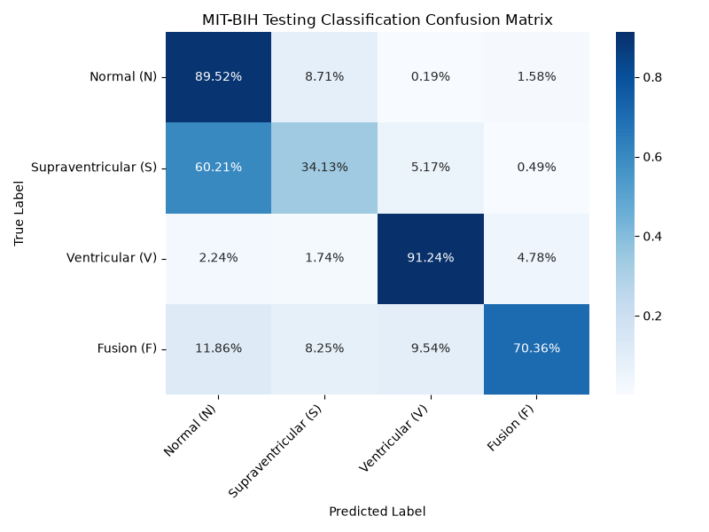
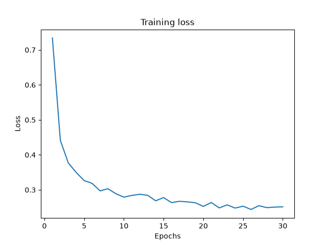
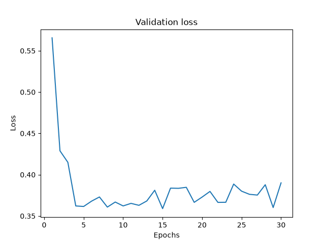
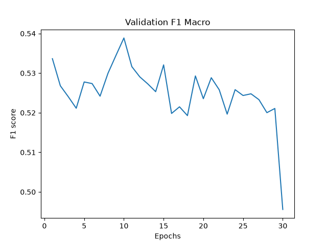

# Advanced-Data-Mining-Task-1


Best CM:



```
{
    window_size: 100
    offset: 10
    USE_FEATURE_SELECTION: True
    N_FEATURES_TO_SELECT : 5
    Criterion: CrossEntropyLoss with class_weights
    lr: 1e-4
    weight_decay: 1e-4
    Epochs: 50
    Patience: 15
}
```
Lite extra data:

```
Final test | Test Loss: 0.4043 - Acc: 87.43% - F1 Macro 60.18%

--- Classification Report Testing dataset ---
                      precision    recall  f1-score   support

          Normal (N)     0.9700    0.8952    0.9311     44255
Supraventricular (S)     0.1372    0.3413    0.1957      1837
     Ventricular (V)     0.9315    0.9124    0.9219      3220
          Fusion (F)     0.2405    0.7036    0.3585       388

            accuracy                         0.8743     49700
           macro avg     0.5698    0.7131    0.6018     49700
        weighted avg     0.9311    0.8743    0.8989     49700
```






